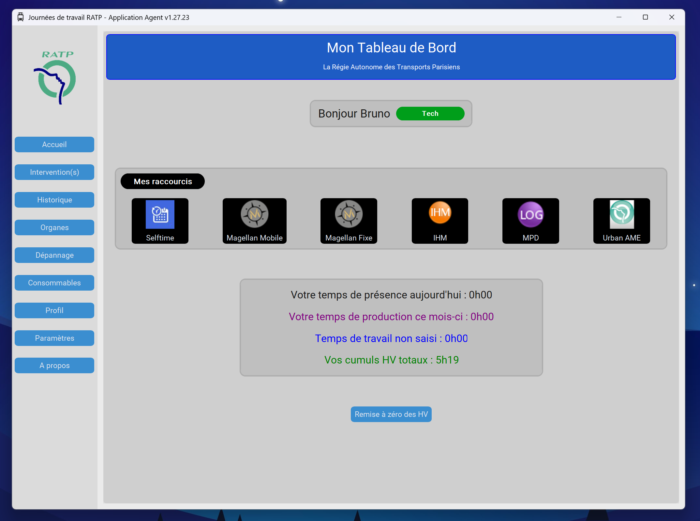
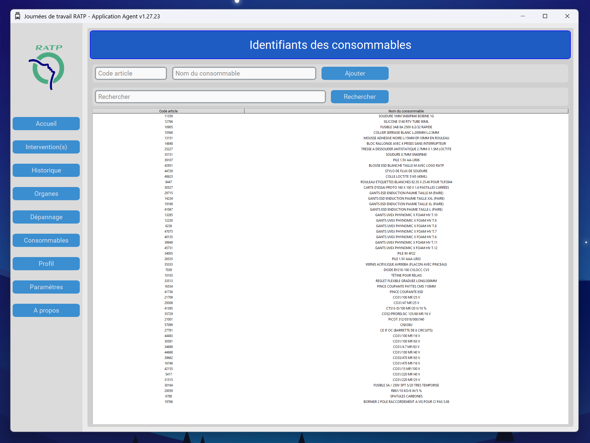
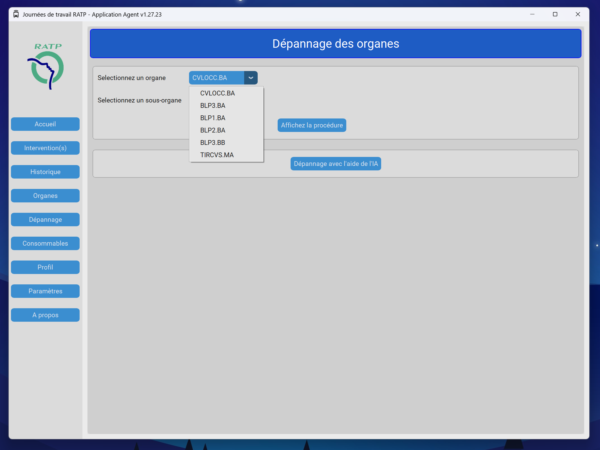
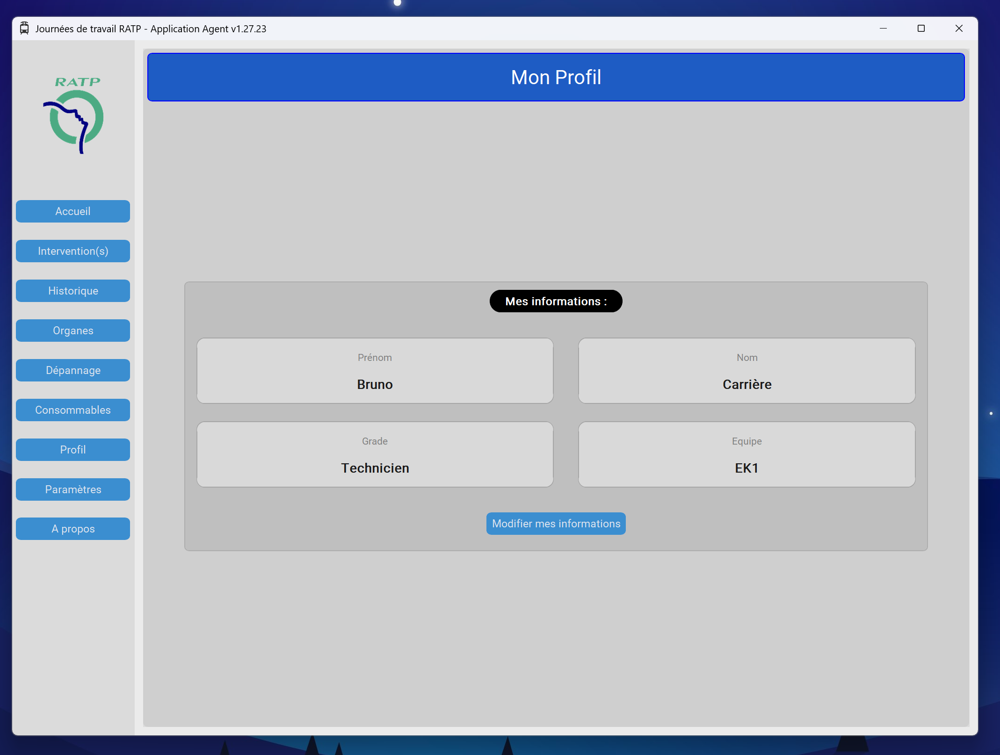

# 🚆 WorkingTimeRATP

Application desktop Python développée pour le suivi des journées de travail, 
des dépannages techniques et des consommables dans un environnement de maintenance ferroviaire.

---

# 📌 Présentation

WorkingTimeRATP est une application métier conçue avec Python et CustomTkinter 
permettant de centraliser plusieurs outils utilisés quotidiennement par un agent de maintenance :

- suivi des journées de travail,
- historique des interventions,
- gestion des organes et sous-organes,
- procédures de dépannage,
- gestion des consommables,
- profil utilisateur personnalisable,
- interface moderne et ergonomique.

L’objectif du projet était de créer une application simple, 
rapide et adaptée à un usage terrain, tout en appliquant une architecture logicielle propre et maintenable.

---

# 🛠️ Technologies utilisées

## Backend / Logique
- Python 3
- JSON / JSONL
- pathlib

## Interface graphique
- CustomTkinter
- Tkinter
- PIL (Pillow)

## Architecture
- Architecture modulaire par pages
- Gestion centralisée des chemins via `Path`
- Séparation :
  - UI
  - données
  - configuration
  - utilitaires

---

# ✨ Fonctionnalités

## 📅 Gestion des journées
- Saisie des journées de travail
- Historique complet des interventions
- Sauvegarde locale persistante

## 🔧 Dépannage
- Gestion des organes et sous-organes
- Création de procédures de dépannage
- Ajout de scénarios et étapes
- Gestion des photos de dépannage

## 📦 Consommables
- Ajout / suppression de consommables
- Stockage persistant en JSONL
- Recherche rapide

## 👤 Profil utilisateur
- Gestion du prénom
- Nom
- Grade
- Équipe
- Interface de modification dynamique

## 🌍 Interface
- Interface moderne avec CustomTkinter
- Gestion du thème
- Support multilingue
- Navigation par sidebar

---

# 📂 Structure du projet

```text
workingtimeratp/
│
├── config/
│   └── paths.py
│
├── data/
│   └── config/
│
├── ui/
│   ├── assets/
│   ├── page_accueil.py
│   ├── page_consommables.py
│   ├── page_depannage.py
│   ├── page_historique.py
│   ├── page_profil.py
│   └── ...
│
├── utils/
│   ├── page_lang.py
│   └── settings.py
│
├── main.py
├── requirements.txt
└── README.md
```

---

# ▶️ Installation

## 1️⃣ Cloner le projet

```bash
git clone https://github.com/BrunoStudi/workingtimeratp.git
```

## 2️⃣ Entrer dans le dossier

```bash
cd workingtimeratp
```

## 3️⃣ Créer un environnement virtuel

```bash
python -m venv venv
```

## 4️⃣ Activer l’environnement

### Windows

```bash
venv\Scripts\activate
```

### Linux / macOS

```bash
source venv/bin/activate
```

## 5️⃣ Installer les dépendances

```bash
pip install -r requirements.txt
```

## 6️⃣ Lancer l’application

```bash
py main.py
```

---

# 📸 Captures d’écran

## Accueil


## Dépannage


## Consommables


## Profil utilisateur


---

# 🔒 Gestion des données

Les données utilisateur sont stockées localement dans le dossier `data/`.

Les fichiers JSON et JSONL ne sont pas versionnés sur GitHub grâce au `.gitignore`.

---

# 🚀 Améliorations futures

- Migration vers SQLite
- Statistiques avancées
- Système de sauvegarde automatique
- Génération d’exécutable Windows
- Intégration de l'IA

---

# 👨‍💻 Auteur

Bruno Carrière

- GitHub : https://github.com/BrunoStudi
- LinkedIn : https://www.linkedin.com/in/bruno-carriere-developpeur-web/

---

# 📄 Licence

Projet développé à des fins pédagogiques et de démonstration technique.